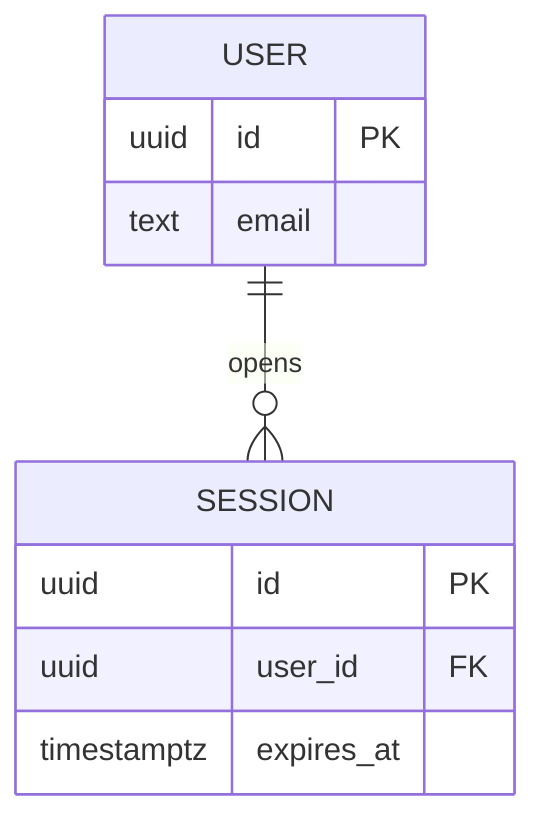

# Diagrams — draw the system, don't just describe it

**Every design document in this folder must contain at least one diagram**
(CI gate G7 checks for it). Prose alone cannot show structure: a reader needs
to see the components, the data, and the flow. Your proposal's *Required
Environment, Resources, and Planned Activities* section is where these
diagrams surface for the reader — draw them here, reference them there.

Use whatever graphical tool you like. Draw *a lot* of them: the diagram you
throw away after ten minutes of argument has already paid for itself.

---

## 1. Which diagram answers which question

Aim for these four by the end of Sprint 3. Most projects need all four.

| Diagram | The question it answers | When |
|---|---|---|
| **High-level architecture** | What are the major pieces and how do they connect? (clients, services, storage, external APIs, deployment boundaries) | Sprint 1–2 |
| **System / context diagram** | Where does our system stop, and who or what is outside it? (users, sponsor systems, third-party services) | Sprint 1 |
| **ER / EER diagram** | What data do we store, and how is it related? (entities, attributes, keys, cardinality; EER adds specialization, inheritance, union types) | Sprint 2–3 |
| **Data flow diagram (DFD)** | How does data move and get transformed? Level 0 (context) then Level 1 (major processes, stores, flows) | Sprint 2–3 |

Add whichever of these earn their place: **sequence diagram** (a request's
path over time, one per critical flow), **state diagram** (objects with a
real lifecycle — an order, a session, a game round), **UI wireframes** (the
screens, before you build them), **deployment diagram** (what runs where),
**class diagram** (only where the object model is genuinely complex).

Rule of thumb: if two teammates argue about how something works for more
than five minutes, the argument is a missing diagram.

## 2. Tools — pick per diagram, not per team

| Tool | Best for | Notes |
|---|---|---|
| **Mermaid** | anything you want *versioned and diffable* | text in the `.md` file; **GitHub renders it automatically**; a diff shows what changed. Start here |
| **Lucidchart** | architecture, ER, DFD, polished deliverables | free education plan; strong templates and shape libraries |
| **draw.io / diagrams.net** | everything, offline, free | save as `.drawio.svg` — editable *and* viewable in the browser |
| **Miro / FigJam** | whiteboarding together before it's settled | great for thinking, weak as a deliverable — export when it stabilizes |
| **dbdiagram.io / ERDPlus** | ER/EER specifically | ERDPlus is built for the EER notation taught in database courses |
| **PlantUML** | UML sequence/class/state as text | more formal UML coverage than Mermaid |
| **Figma** | UI wireframes and screen flows | export frames to PNG for the repo |
| **Excalidraw** | fast hand-drawn sketches | `.excalidraw` files are JSON, so they version cleanly |

## 3. How diagrams live in this repository

Commit **both** forms, always:

```
docs/design/
├── architecture.md              ← the design doc; explains the diagram
├── diagrams/
│   ├── architecture.drawio.svg  ← editable source (or .lucid link, .excalidraw)
│   ├── architecture.png         ← exported image the doc embeds
│   └── er-model.png
```

- **Editable source** so the next person can change it. A PNG with no source
  is a dead end — and the next person is you in CPSC 491.
- **Exported image** so it renders in the PR and in GitHub's file view.
  Reviewers will not open a `.drawio` file; they will look at a picture.
- If the tool is cloud-only (Lucid, Figma, Miro), commit the export **and**
  put the share link in the document, with view access for the whole team
  plus the instructor.
- Embed with a real caption and alt text:

```markdown


*Figure 2 — Level-1 DFD. Processes are numbered to match §3.2.*
```

**Prefer Mermaid when the diagram is structural and likely to change**, since
it lives in the document and shows up in diffs:

````markdown

````

## 4. Diagrams in the proposal

Your *Required Environment, Resources, and Planned Activities* section should
carry the high-level architecture and system diagrams, plus whichever of the
ER/DFD views the reader needs to understand what you are building and what it
depends on. Keep the authoritative copies here in `docs/design/` and
reference them from the proposal — one source, two audiences. Every figure
gets a number, a caption, and a sentence in the prose that *points at it*
("Figure 1 shows…"). A diagram nobody references is decoration.

## 5. Every diagram is a claim — verify it

Diagrams are where fabrication hides most comfortably. An LLM will happily
produce a beautiful architecture with a service you never chose, and a
reviewer's eye slides right over a box that looks plausible.

You may absolutely ask an assistant to draft Mermaid from your notes — it is
good at that, and it saves real time. Then, at
[Gate 2](../aidlc/hitl-gates.md#gate-2--self-verify-you-read-it-then-you-run-it):

- **Every box** must be something that exists or that you have decided to
  build — no invented services, no libraries you have not chosen.
- **Every arrow** must be a real call, dependency, or data movement, in the
  direction shown. Arrows are claims about coupling.
- **Every entity and attribute** in an ER diagram must match your actual
  schema or your intended one — not a generic e-commerce model the assistant
  has seen a thousand times.
- **The diagram and the prose must agree.** When they disagree, the diagram
  is usually the one that is stale — fix it in the same PR.
- In review (Gate 4), ask: *does this diagram describe our system, or a
  textbook system?* Generic-looking diagrams are the tell.

## 6. Checklist per diagram

- [ ] It answers one question, stated in the caption
- [ ] Numbered figure, referenced from the prose
- [ ] Editable source **and** exported image committed
- [ ] Legend or labels for anything not obvious
- [ ] Every box and arrow verified against reality (§5)
- [ ] The design doc names its epic and stories at the top (gate G2)
