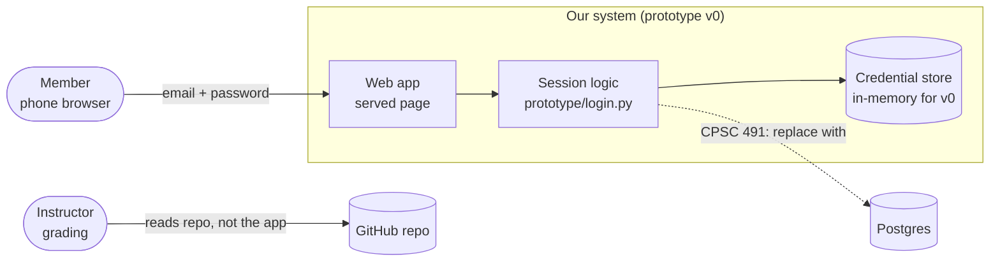
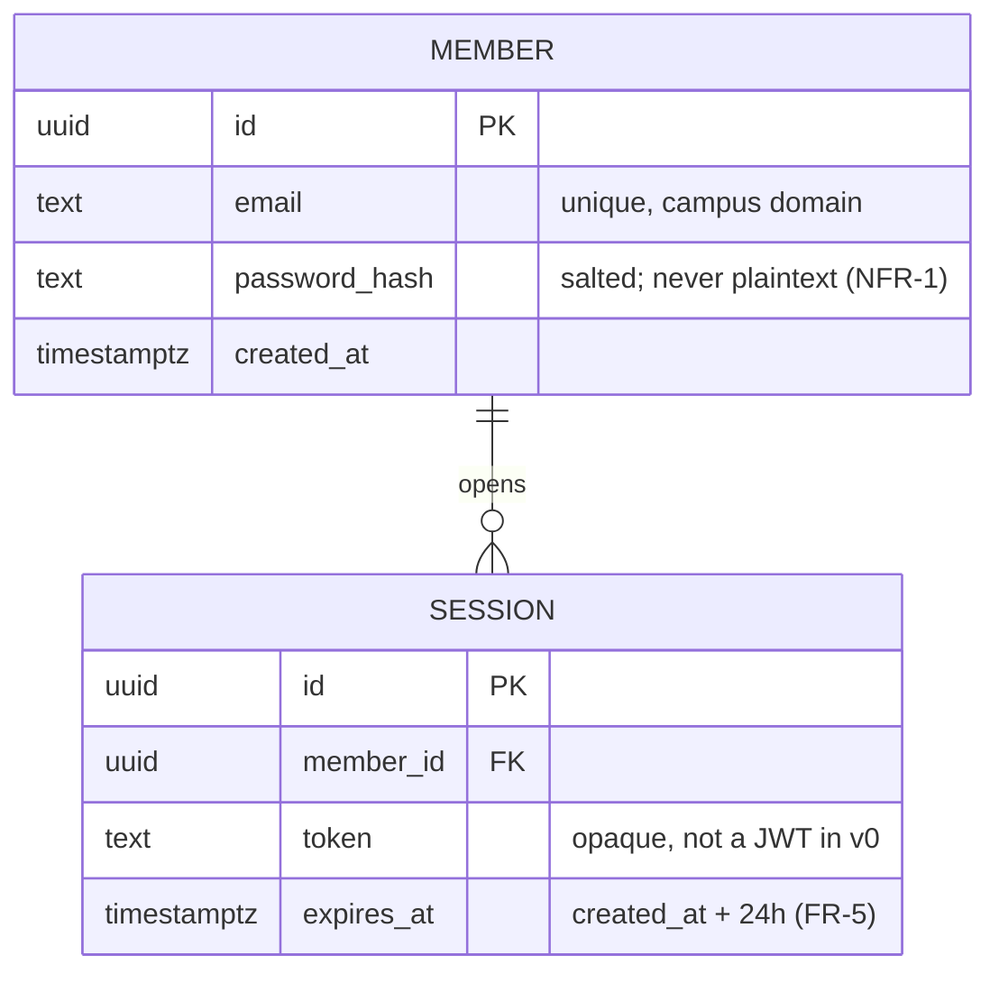
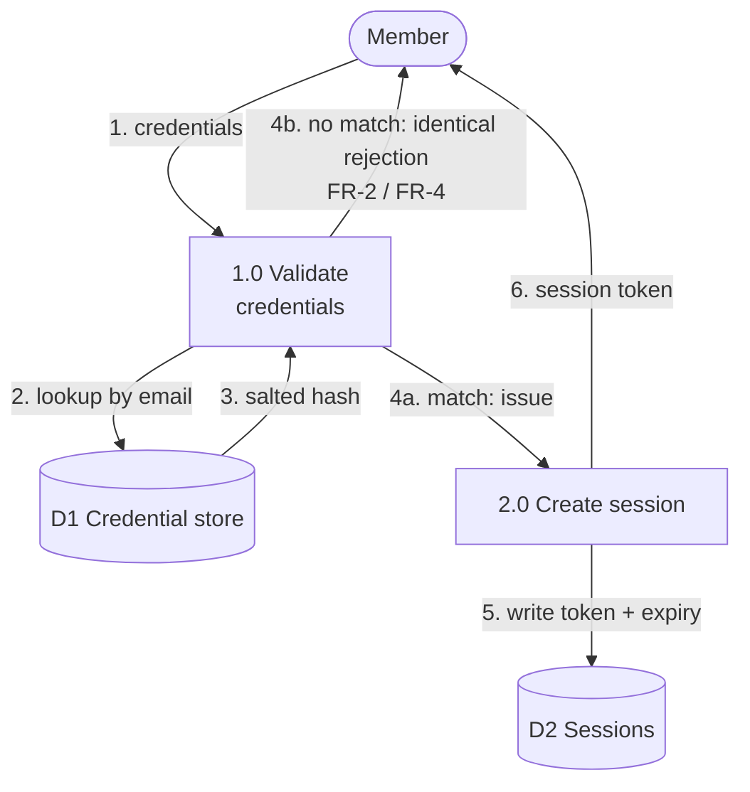

# Design — Account management architecture and data model

> Epic: #1 · Stories: #4
> Owner: 〈name〉 · Sprint: 3 · Status: draft
> Specification: [`../specs/example-spec.md`](../specs/example-spec.md)

*A worked example of a design document: it names its issues (gate G2),
carries real diagrams (gate G7), and every box and arrow corresponds to
something that exists or that the team has decided to build. Replace it with
your own — and see [`DIAGRAMS.md`](DIAGRAMS.md) for tools and conventions.*

## 1. System context

Who and what is outside our boundary, and what crosses it.

*Figure 1 — System context. Solid lines exist in prototype v0; the dashed
line is a CPSC 491 intention, marked as such so nobody reads it as built.*

## 2. Components

| Component | Responsibility | Interface | Where |
|---|---|---|---|
| Served page | collects credentials, shows session state | HTML form → `POST /session` | `prototype/` (v1) |
| Session logic | validates credentials, issues/expires tokens | `issue_session(email, password) -> token` | `prototype/login.py` |
| Credential store | holds email → salted hash | dict in v0, table in 491 | `prototype/login.py` |

## 3. Data model

*Figure 2 — Entity-relationship model. One member has many sessions; a
session cannot exist without a member. Attribute notes cite the requirement
they satisfy, so a reviewer can check the design against the spec.*

## 4. Data flow (level 1)

*Figure 3 — Level-1 DFD. Numbered flows match the steps in §5. Note that
both failure paths (4b) converge on one response — that is NFR-2, and it is
the kind of property a diagram makes obvious and prose hides.*

## 5. Key decisions

| Decision | Options considered | Chosen | Why |
|---|---|---|---|
| Session format | JWT · opaque random token | opaque token | v0 needs revocability and has no second service to verify a signature; JWT adds key handling we would have to secure for no benefit yet |
| Password hashing | SHA-256 + salt · bcrypt · argon2id | argon2id in 491, salted HMAC in v0 | v0 proves the flow; the real KDF is a 491 story so we do not ship a weak one by accident |
| Credential store | in-memory dict · SQLite · Postgres | dict for v0 | the risky question is the flow, not persistence (see §1 dashed line) |

## 6. What is NOT designed yet

Password reset, SSO, 2FA, and permissions are out of scope per the
specification. They have no boxes in Figure 1 on purpose — an empty space in
a diagram is information.
